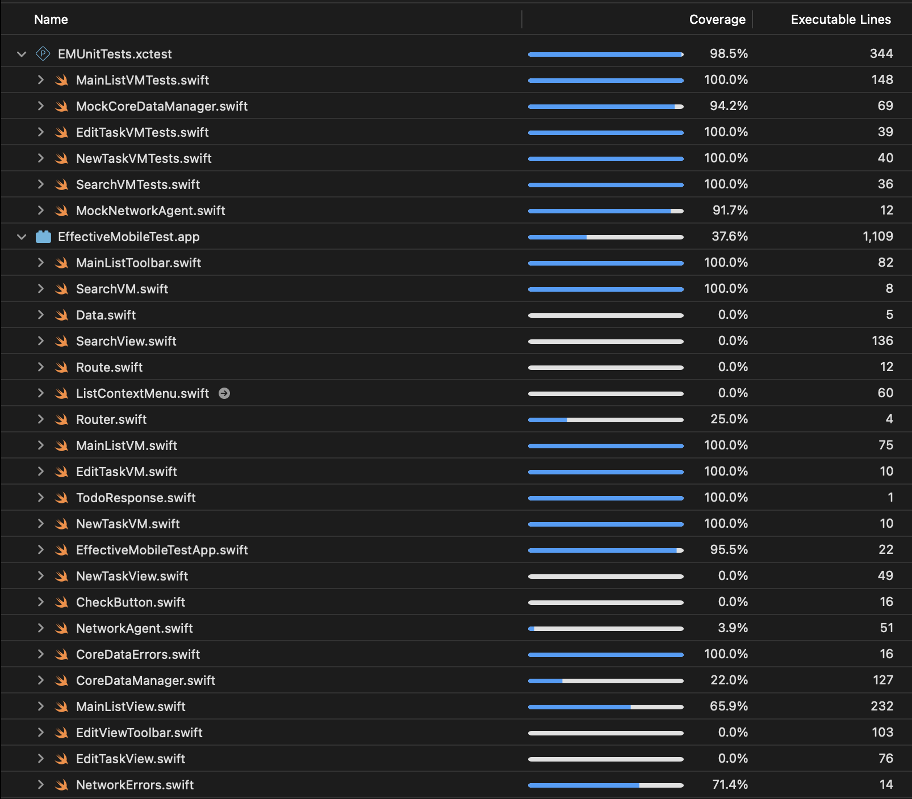

# Приложение TodoList

  

## Стек
- Swift 5
-	SwiftUI
-	Combine
-	Core Data
-	MVVM архитектура
-	Юнит-тесты с использованием Testing

## Функционал
- Отображение списка задач на главном экране.
- Возможность добавления новой задачи.
- Возможность редактирования существующей задачи.
- Возможность удаления задачи.
- Возможность поиска по задачам.

Загрузка списка задач из dummyjson api: **https://dummyjson.com/todos**.

## Тестирование
-	Используются моки MockNetworkAgent и MockCoreDataManager
-	Протестированы вью моделии: MainListVM, EditTaskVM, NewTaskVM, SearchVM
-	Используется фреймворк Testing
- Покрытие кода: 52%

  

## Требования
-	Xcode 15+
-	iOS 18.5+
-	Swift 5
